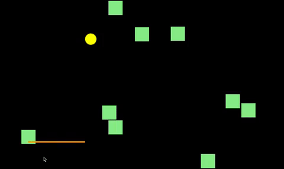

# Bouncing Ball Game

This is a Bouncing Ball game programmed with HTML/CSS/JavaScript.

1. Player may open "index.html" to start a game.
2. Player may use mouse and move horizontally to control the paddle's position and let the ball bounce back and change direction.
3. Refresh the website to start a new game.

**_Just play it and enjoy the game!!!_**
